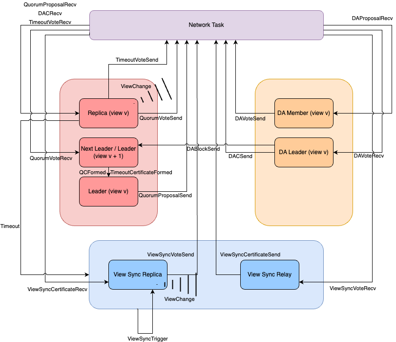

HotShot uses an event-based architecture.  This architecture is made of 4 main tasks: Network Task, View Sync Task, Consensus Task, and DA Task.  The Network Task handles all incoming and outgoing messages.  It forwards incoming messages to the correct task and listens for outgoing messages from the other tasks.  The View Sync Task coordinates the view sync protocol.  It listens for timeout events from the Consensus Task.  Once a certain threshold of timeouts seen has been reached, the View Sync Task starts the View Sync protocol to bring the network back into agreement on which view it should be in. The Consensus Task handles the core HotShot consensus logic.  It manages replicas that listen for quorum proposals and vote on them, leaders who send quorum proposals, and next leaders who listen for quorum votes and form QCs.  The DA task handles the data availability protocol of HotShot.  It listens for DA proposals, sends DA proposals, and forms a Data Availability Certificate (DAC)

A diagram of how events interact with each task is below: 

For more information about each event see `./src/events.rs`
